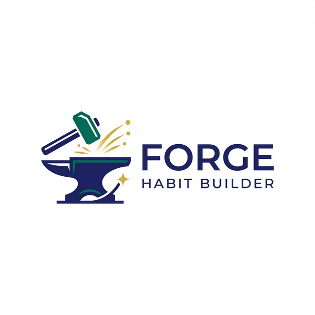

# AI Modality Usage Log

This document tracks how AI tools were used across the development of Forge, covering both Claude Web (conversational AI for planning and review) and Antigravity IDE (AI powered code editor for generation and scaffolding).

## Modality 1: Claude Web (Planning, Architecture, Code Review)

### Project Planning and PRD

Used Claude Web to develop the initial PRD including user personas, user stories with acceptance criteria, data model design, sprint planning, and the feature priority matrix. Claude helped structure the Mom Test interview simulations that validated our product assumptions before writing any code.

### Architecture Decisions

Used Claude Web to evaluate architectural tradeoffs:

- Server Components vs Client Components boundary decisions
- Whether to use Supabase PostgREST joins vs JavaScript side joins for multi table queries (chose JS joins for reliability)
- Vote computation strategy: storing votes vs computing from check_ins (chose computed for data integrity)
- Soft delete pattern with archived_at vs hard delete for routines and identities

### Implementation Planning

Before each screen was built, Claude Web was used to create a detailed implementation plan: exact files to create, component interfaces, prop types, data flow, and build order. This eliminated guesswork during the coding phase.

Example: The Scorecard screen plan specified 8 files in exact build order (hooks first, components bottom up, page last) with the rationale for each decision. This pattern was reused for Stacks and Identity.

### Code Review and Bug Catching

Claude Web caught a timezone bug where `toISOString()` was converting dates to UTC, causing the date navigator to show "Thu, Mar 12" instead of "Today" for a user in Pacific time at 7 PM. The fix was switching to local date math everywhere dates are formatted.

Also identified that the Supabase anon key format was incorrect before it became a blocking issue (JWT format vs the short key that was initially shared).

## Modality 2: Antigravity IDE (Code Generation, Scaffolding)

### Foundation Layer (Abhishek's work)

Antigravity was used with the AGENTS.md rules file to generate:

- Supabase client configurations (browser, server, middleware)
- TypeScript type definitions matching the database schema exactly
- Zod validation schemas
- Shared UI components (Button, Card, Input, Modal) following the design token system
- Dashboard layout with responsive sidebar/bottom nav
- Landing page with the Forge brand identity
- CI/CD pipeline configuration

### Feature Screens (Derek's work)

Antigravity (with Claude Web providing the implementation plans) was used to generate:

- All custom hooks (useRoutines, useCheckIns, useStacks, useIdentities) with Supabase queries, error handling, and optimistic UI updates
- All feature components matching the mockup designs
- Page files that wire hooks and components together with proper state management

### Impact of AGENTS.md Rules File

The rules file had a measurable impact on code generation quality. Without it, the AI agent would make mistakes like:

- Using wrong table names or column names that don't match the migration
- Implementing custom API routes instead of using Supabase RLS directly
- Using incorrect auth patterns (e.g., not calling getUser() before queries)
- Creating files in the wrong directories or with wrong naming conventions

With the rules file, generated code aligned with the data model, folder structure, and architectural patterns on the first attempt in most cases.

## Modality 3: Creative Modality (Image Generation)

### App Branding and Assets

Used Antigravity's `generate_image` tool to create high-quality branding assets for Forge. Instead of using generic placeholder icons, we generated custom logo concepts that align with the "Forge" identity—focusing on themes of strength, craftsmanship, and habit building.

- **Logo Concept**: Generated a premium, minimalist logo featuring a stylized anvil and hammer striking a spark, using a sophisticated indigo and gold palette. This was used to define the visual brand and UI inspiration.

- **Visual Theme**: The generated assets influenced the choice of "premium, warm, and confident" design language used across the dashboard screens.

## How the Modalities Complement Each Other

The workflow was: Claude Web creates the plan (what to build, in what order, with what interfaces), then the code is generated following that plan with the AGENTS.md rules enforcing project conventions.

Claude Web is better at: reasoning about architecture, catching bugs in logic, evaluating tradeoffs, writing documentation, and creating implementation plans.

Antigravity IDE is better at: generating boilerplate, scaffolding components from a known pattern, writing repetitive code (like Supabase CRUD operations), and applying consistent styling with Tailwind.

Neither tool was used in isolation. The combination produced higher quality output than either would alone.
